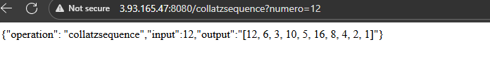

## PARCIAL SEGUNDO CORTE

Dentro de la carpeta math se encontrara la implementacion para la secuencia de collatz y dentro de la carpeta proxy esta la implementacion para enviar a las ec2 las peticiones en el orden correspondiente

## Instrucciones despliegue
Crear una instancia de ec2

En consola colocar el siguiente comando

sudo yum update -y

Luego para instalar tanto maven como git y java 17 seguir los siguientes comandos

sudo yum install maven -y
sudo yum install git -y
sudo yum install java-17-amazon-correto -y

Luego clonamos este repositorio https://github.com/Daniel-Aldana10/arepparcial2

Luego vamos al directorio

cd arepparcial2

Y ponemos el comando mvn package

Luego se nos generara una carpeta target donde estara un .jar por ultimo ponemos

java .jar nombre-ejemplo.jar

Y se estara ejecutando la aplicacion en el puerto 8080

Toca ir al grupo de seguridad de la ec2 y agregar esta nueva regla

## Pantallazos

### Instancia 1 con mathservices

### Instancia 2 con mathservices

### Instancia Proxy
